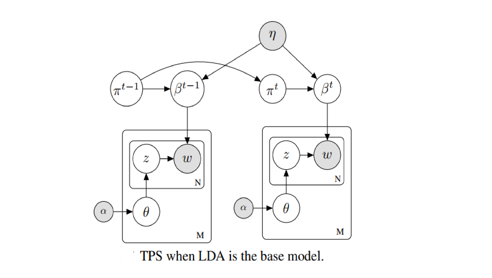

# TPS
This is an implementation of [Dynamic transformation of prior knowledge into Bayesian models for data streams](https://ieeexplore.ieee.org/abstract/document/9667285) (TPS). TPS is a general framework that enables to incorporate the prior knowledge of different forms into a base Bayesian model for data streams. For the detail content, please visit our paper.

Some contribution of our framework:
*	TPS is able to convert any existing batch learning Bayesian models to streaming learning Bayesian models by reusing local inference steps.
*	TPS is able to use prior knowledge in different forms by learning a mapping function to transform the prior into the desired form.
*	Experimental results on two case studies with [LDA](http://www.jmlr.org/papers/volume3/blei03a/blei03a.pdf), [NB]() show that TPS outperforms state-of-the-art streaming learning framework such as, SVB ([Broderick et al., 2013](https://arxiv.org/pdf/1307.6769.pdf)), PVB ([McInerney et al.,  2015](https://arxiv.org/pdf/1507.05253.pdf)), SVP-PP ([Masegosa et al., 2017](http://proceedings.mlr.press/v70/masegosa17a/masegosa17a.pdf)) and KPS ([Duc, Anh Nguyen et al., 2017](https://link.springer.com/chapter/10.1007/978-3-319-57529-2_20)).

In this implementation, we illustrate a case study for TPS with LDA as the based-model with the graphical model as below.


## Installation
1. Clone the repository
```
		https://github.com/bachtranxuan/TPS.git
``` 
2. Requirements environment
```
		Python 2.7
		Numpy, Scipy
```
## Training
You can run with command
```
	python run_Streaming.py [Training file] [Setting file] [Model folder] [Testing folder] [Prior file].
```
Example
```
python run_Streaming.py data/train.txt data/setting.txt data/result data data/prior.glove.200d.txt.
```
## Data descriptions
Data for training consists of an external knowledge and a set of documents.
*	We use the bag-of-words model to represent documents. Each document is represented by a sparse vector of word counts. Data ís saved in a file (data/train.txt) in which each row is a document representation in form:
```
	[M] [term_id1]:[count] [term_id2]:[count] ... [term_idN]:[count]
	where [M] is the total of unique terms and the [count] is the word counts of each corresponding term in the document.  We note that both vertex_id and term_id refer to word_id in the vocabulary (data/vocab.txt).
```
*	Setting file contains the value of parameters (hyperparameter) of the model such as alpha (hyperparameter of the model), n_topics (number of the topic), learning_rate (learning rate in gradient descent algorithm) .... (E.g data/setting.txt). 
```
		alpha 0.01
		n_topics 50
		n_terms 2823
		batch_size 500
		n_infer 50
		learning_rate 0.01
		sigma 0.01
```
*	Prior file, includes V lines which V is the number of word of set vocab. Each line is a representation of word such as w2v which was pre-trained from 6 billion tokens of Wikipedia2014 and Gigaword5 ([JeffreyPennington., 2014](https://nlp.stanford.edu/projects/glove/)) (E.g: data/prior.glove.200d.txt).

Each document in the test set is divided randomly into two disjoint part (part_1) and (part_2) with a ratio of 4:1. We compute the predictive probability of part_2 when given part_1. The two parts are saved in two files: data/data_test_1_part_1.txt and data/data_test_1_part_2.txt respectively.  Their forms are the same as the training data file.

### Performance Measure:
We use log predictive probability ([LPP](http://jmlr.org/papers/v14/hoffman13a.html))  and Normalized pointwise mutual information ([NPMI](https://www.aclweb.org/anthology/E14-1056/)) to measure performance. While LPP is computed on the test set after training the model on each minibatch, NPMI is calculated on the whole training set after finishing training process. 

## Result
We compare our model with four state-of-the-art base-lines:
SVB ([Broderick et al., 2013](https://arxiv.org/pdf/1307.6769.pdf)), PVB ([McInerney et al.,  2015](https://arxiv.org/pdf/1507.05253.pdf)), SVP-PP ([Masegosa et al., 2017](http://proceedings.mlr.press/v70/masegosa17a/masegosa17a.pdf)) and KPS ([Duc, Anh Nguyen et al., 2017](https://link.springer.com/chapter/10.1007/978-3-319-57529-2_20)). We conduct intensive experiments with several scenarios that are described more explicitly in the paper. Here are some results.


Some topics are learned from data
```
| Topic\word  |   
|:-----------:|------------|------------|------------|------------|------------|------------|-------------|------------|------------|-----------|
| Military    |    war     |    army    |   naval    |    navy    |  commader  |   commad   |   military  |   forces   |    air     |  ship     |
| Music       |  music     |   musical  |   piano    |   songs    |  composer  | orchestral | instruments |  orchestra |   vocal    |  sound    |
``` 
## Citation
if you find that TPS is useful for your research, please citing:
```
@article{tran2021dynamic,
  title={Dynamic transformation of prior knowledge into Bayesian models for data streams},
  author={Tran, Bach and Nguyen, Anh Duc and Van, Linh Ngo and Than, Khoat},
  journal={IEEE Transactions on Knowledge and Data Engineering},
  year={2021},
  publisher={IEEE}
}
```

